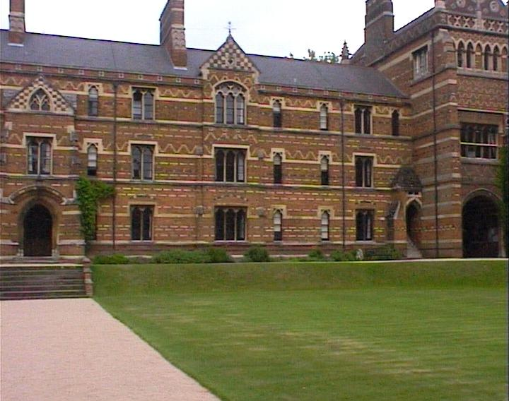

# RANSAC Homography Estimation

## Input

 

## Steps

Merge the above images into a Mosaic as follows:

<ul>
  <li>Choose one image as the reference image frame.</li>
  <li>Estimate a homography between each of the remaining images and the reference one. Each homography estimation is done by:
    <ul>
      <li>Detecting local features in each image</li>
      <li>Matching feature descriptors between two images</li>
      <li>Estimating the homography between two images with RANSAC for robustness to wrong keypoint correspondences</li>
    </ul>
  </li>
  <li>Warping each image into the reference frame using the estimated homography and composite the warped images into a single mosaic</li>
</ul>

## Merged Image using SIFT Descriptors

 

## Merged Image using FAST Descriptors

 

